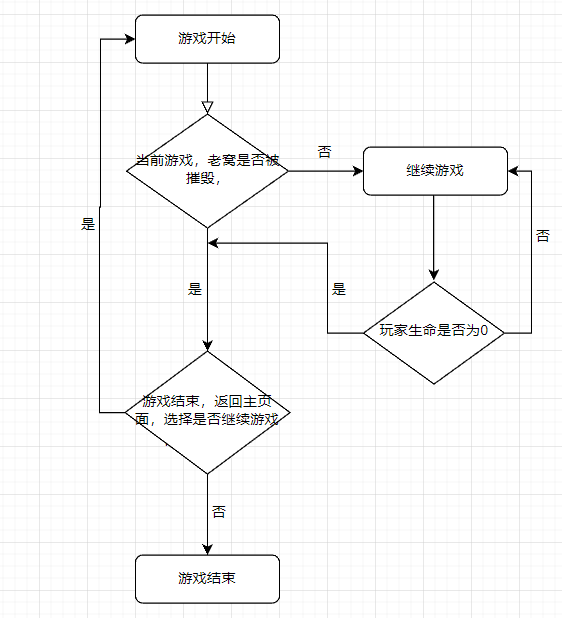

# 一. 项目概述

本次项目是基于Unity引擎的坦克大战游戏，其脚本是使用C#编写的。坦克大战是一种经典的游戏类型，玩家可以控制自己的坦克与其他玩家或电脑控制的坦克进行战斗。此项目旨在利用Unity引擎的功能和特性并结合使用C#脚本语言，从而可以方便地编写游戏逻辑和实现各种功能。

在这个基于Unity引擎的坦克大战项目中，主要实现了以下几个功能：

- 玩家坦克控制：通过编写C#脚本，实现了玩家可以使用键盘来控制自己的坦克移动、旋转和射击等操作。在脚本控制下，可以处理玩家输入并更新坦克的状态和位置。
- 地图设计：利用Unity引擎的编辑器和C#脚本，设计了多个地图，包括地形、障碍物和战斗区域等。在脚本控制下，实现了地图元素的生成和布置，以及与坦克的碰撞检测等功能。
- 敌人坦克控制：通过编写代码逻辑，实现了敌人坦克的行为和战斗策略。在此代码逻辑控制下，敌人能够自主地寻找目标、追击玩家和进行攻击，并在Unity引擎中提供的组件（Colliders、Rigidbody）里负责处理敌人坦克与玩家坦克之间的交互和碰撞检测等逻辑。
- UI界面：此项目游戏具有友好的用户界面，包括主菜单、游戏设置、得分板等。玩家可以通过UI界面选择游戏模式（单人、双人）、调整游戏设置并查看游戏状态和得分。

# 二. 系统功能设计

> 包括所有的功能模块，详细说明其模块功能以及实现的业务流程（用流程图进行说明）。

***游戏控制模块、角色控制模块、物体交互模块、特效显示模块、UI模块、场景管理模块。***

## 2.1 游戏流程控制模块




游戏流程控制模块是由两个C#脚本文件进行控制：

`PlayerManager.cs`和`DoublePlayerManager.cs`

该两个文件分别对应单人模式以及双人模式：

### 2.1.1 单人模式

单人模式下，只有一个玩家, 我们该类定义的一些游戏属性有以下几点:

***玩家的生命值：***

```C#
// 1. 玩家的生命值
public int health = 5;
```

***玩家的分数***

```C#
// 2. 玩家的分数
public int playerScore = 0;
```

***玩家是否被打败以及是否死亡***

```C#
// 3. 玩家是否死亡，我们设置的角度是玩家死亡可以进行一个复活
public bool isDead;
// 4. 玩家是否被打败，也
public bool isDefeated;
```

***绑定主界面UI中的相应的分数以及生命值：***

```C#
public TMP_Text playerHealthText;
public TMP_Text playerScoreText;
```

***引用出生特效以及游戏结束的UI页面***

```C#
public GameObject bornEffectPrefab;
public GameObject gameOverUI;
```

### 2.1.2 双人模式

双人模式和单人模式类似，只不过添加了几个属性罢了。

## 2.2 角色控制模块

该模块下面的关键技术会在下面进行详细的解释。

## 2.3 物体交互模块

该模块主要就是利用的unity中为我们封装好的碰撞检测与触发事件：利用Unity的碰撞器（`Collider`）和刚体（`Rigidbody`）组件，实现物体之间的碰撞检测和触发事件。可以通过设置碰撞器的属性、使用触发器（Trigger）和物理材质等方式来控制碰撞的行为和触发事件的响应。

我们利用unity中的碰撞处理来触发我们游戏当中的爆炸特效：在发生碰撞时，对碰撞的结果进行处理。这可以包括处理物体之间的物理反应（如反弹、施加力）、触发特定的动画、触发音效或粒子效果等。可以通过编写脚本，在碰撞事件的回调函数中执行相应的处理逻辑。

## 2.4 场景管理模块

关于场景管理，我们项目中一共有三个场景之间进行切换，我们设计了一个类管理场景之间的切换和加载。关于场景初始化的话，我们在切换到新场景的时候需要一些初始化，我们项目中在切换到相应的场景中，每一个场景之中都会有一个类来专门来初始化：在切换到新场景时，可能需要进行一些初始化操作，例如重置游戏状态、重置玩家位置、加载必要的资源等。我们

场景数据传递：在场景之间传递数据，例如在不同场景之间传递分数、解锁的关卡等信息。这可以通过静态变量、全局数据管理类或使用场景切换时的参数传递实现。

场景间的通信：不同场景之间可能需要进行通信，例如在一个场景中触发的事件需要影响其他场景中的对象。可以使用委托和事件等机制来实现场景间的通信。

场景状态管理：在游戏中可能存在不同的场景状态，例如游戏开始、游戏暂停、游戏结束等。需要管理这些状态并根据不同状态执行相应的逻辑和操作。

场景特效和过渡效果：为了增强游戏体验，可以在场景切换时添加过渡效果或特效。例如淡入淡出效果、过渡动画等，可以使用Unity的动画系统或特效系统实现。

场景管理器的设计：可以考虑设计一个独立的场景管理器类，用于统一管理和组织场景相关的功能和逻辑。这样可以提高代码的可维护性和可扩展性。

# 三. 关键技术与核心代码

> 按照模块分析实现过程中的关键技术，并附上核心代码（代码需要有注释，而且务必需要注明具体是由哪位组员实现的）。

## 3.1 委托和事件的触发

我们游戏环节中使用到事务以及事件的地方有下面几点：

### 3.1.1 双人模式玩家击中玩家相应的分数累加

> 因为场景中有两个玩家，我们设计的思路是设计一个双人模式游戏管理类来统一管理当前游戏中游戏玩家的状态。

事件委托的声明：

```C#
// 如果子弹射到了敌人，如果是玩家的子弹的话，会触发下面的事件，记录玩家的分数
public delegate void GetScore(string tag);
public static event GetScore OnGetScore;

public static void InvokeOnGetScore(string tag)
{
    if(OnGetScore != null)
    {
        OnGetScore.Invoke(tag);
    }
}
```

`public delegate void GetScore(string tag);` 这行代码定义了一个委托类型 `GetScore`，它可以表示一个没有返回值且接受一个字符串参数 `tag` 的方法。

`public static event GetScore OnGetScore;` 这行代码声明了一个名为 `OnGetScore` 的静态事件。事件是委托的特殊用法，它提供了一种机制，允许其他代码注册为事件的订阅者，以便在事件触发时执行相应的操作。在这里，`OnGetScore` 事件使用了 `GetScore` 委托类型。`if (OnGetScore != null)` 这行代码检查 `OnGetScore` 事件是否有订阅者。在事件被触发之前，我们需要验证事件是否已经有订阅者注册。

`OnGetScore.Invoke(tag);` 这行代码通过调用 `OnGetScore` 事件来触发它。如果有订阅者注册了该事件，它们的方法将被执行，并且传递的参数是 `tag` 字符串。这里的话我们是设置的玩家类中，进行一个订阅事件的操作:

```C#
// 订阅事件
void OnGetScore()
{
    Bullet.OnGetScore += ifMyBullet;
}

void ifMyBullet(string tag)
{
    if (isDouble)
    {
        if (tag == "PlayerBullet")
        {
            DoublePlayerManager.Instance.playerScore1++;
        }
    }
}
```

`Bullet.OnGetScore += ifMyBullet;` 这行代码订阅了 `Bullet` 类的 `OnGetScore` 事件。当 `OnGetScore` 事件被触发时，将执行 `ifMyBullet` 方法。

### 3.1.2 子弹与铁墙碰撞，敌人会停止攻击并且进行一个随即转向

> 这里为什么要使用到委托，因为我们在开发游戏的过程中，碰到了一个bug，就是当敌人发射的子弹碰撞到铁墙的时候，敌人会一直进行射击，由于我们是设置了音效的，所以就会产生连绵不断的音效，所以我们这里设置了一个委托和事件的触发。当然了我们这样作业也是为了可以管理场景中的每一发子弹。

代码方面同样的：

```C#
 // 如果敌方坦克射击到了铁墙，就停止射击
public delegate void HitIronWall(int tankId);
public static event HitIronWall OnHitIronwall;
```

下面是敌人类进行一个事件的订阅：

```C#
 // 订阅事件
void OnHitWall()
{
    Bullet.OnHitIronwall += ifHitWall;
}

void ifHitWall(int belongId)
{
    if(id == belongId)
    {
        Debug.Log(id + "号坦克的子弹射中了墙壁");
        ifFire = false;
        Invoke("resetFire", 3);
        timeValChangeDirection = 4;
    }
}
```

其中`timeValChangeDirection`是我们设置的转向的时间，如果该时间为4，也就是4秒之后，敌人就会随机进行转向。

## 3.2 敌人自动移动

敌人的自动移动是怎么实现的，我们设置的是利用随机数:

```C#
int num = Random.Range(0, 8);
if (num > 3)
{
  // 向下移动
    vertical = -1;
    horizantal = 0;
}
else if(num == 0)
{
  // 向上移动，即敌人往自己的家的方向移动
    vertical = 1;
    horizantal = 0;
}
else if(num > 0 && num <= 2)
{
  // 往左移动
    vertical = 0;
    horizantal = -1;
}
else
{
  // 向右移动
    vertical = 0;
    horizantal = 1;
}
```

## 3.3 玩家的移动和射击

### 3.3.1 玩家的移动

这里简单的解释就是我们利用的是unity的虚拟轴相关的知识点，我们手动进行一个映射，将按键进行一个映射。

```C#
horizantal = Input.GetAxis("HorizontalPlayer1");
transform.Translate(Vector3.right * horizantal * moveSpeed * Time.fixedDeltaTime, Space.World);

if (horizantal > 0)
{
    spriteRenderer.sprite = tankSprite[1];
    bullectEulerAngles = new Vector3(0, 0, -90);
}
else if (horizantal < 0)
{
    spriteRenderer.sprite = tankSprite[3];
    bullectEulerAngles = new Vector3(0, 0, 90);
}
if (horizantal != 0)
{
    return;
}
```

### 3.3.2 玩家的射击

就是检测玩家的输入，如果按下空格键的话就会，实例化一个子弹实例，子弹上面挂载有相关的C#脚本控制子弹的移动等等。

```c#
// 2. 坦克攻击方法
private void Attack()
{
    if (Input.GetKeyDown(KeyCode.Space))
    {
        GameObject temp = Instantiate(bulletPrefab, transform.position, Quaternion.Euler(transform.eulerAngles + bullectEulerAngles));
        temp.GetComponent<Bullet>().isPlayerBullet = true;
        timeVal = 0;
    }
}
```

## 3.4 单例模式的应用

```C#
// 单例模式
private static PlayerManager instance;
public static PlayerManager Instance
{
    get
    {
        return instance;
    }
    set
    {
        instance = value;
    }
}
```

首先，`private static PlayerManager instance;` 定义了一个私有的静态变量 `instance`，它将保存唯一的 `PlayerManager` 实例。

然后，`public static PlayerManager Instance` 是一个公共的静态属性，它提供了对 `instance` 变量的访问。通过 `get` 方法，可以获取当前的 `PlayerManager` 实例，而通过 `set` 方法，可以设置新的实例。

这种设计模式确保只有一个 `PlayerManager` 实例存在于应用程序中。其他部分可以通过 `PlayerManager.Instance` 访问该实例，以进行必要的操作和数据访问。

使用这种模式的好处是确保全局只有一个 `PlayerManager` 实例，以便统一管理和控制玩家对象的行为和属性。


# 四.成员角色与分工

| 职位 | 学号     | 姓名   | 任务分工                           | 贡献占比 |
| ---- | -------- | ------ | ---------------------------------- | -------- |
| 组长 | 20121333 | 周鹏飞 | 双人模式下面相关的逻辑设计以及实现 | 60%      |
| 组员 | 20122005 | 谢华   | 单人模式下面相关的代码逻辑以及实现 | 40%      |

> 注： 项目的开发过程中，代码有的地方存在冗余，组员之间商量之后，有的代码是选择了进行合并，有的冗余的代码没有进行处理。除此之外呢，我们这个项目，由于是游戏开发，所以说涉及到的一些美术相关的一些内容，是由组员共同克服以及实现的。
>

# 五. 个人体会

<h2>20121333 周鹏飞</h2>

当我选择使用Unity制作游戏时，我发现我在本学期学习的C#知识点非常有用。特别是委托和事件这两个概念在游戏开发中起到了重要的作用。

委托是C#中非常强大和灵活的概念，它允许我定义一个代表方法的类型，并将其用作参数、变量或返回值。在游戏中，我经常使用委托来实现回调功能。例如，我可以定义一个委托类型，代表某个特定事件发生时应该执行的方法，然后在游戏中注册这些方法作为事件的订阅者。这使得我能够实现模块之间的松耦合，以及在特定事件发生时执行相应的逻辑。

在Unity中，事件是委托的一种特殊用法。我可以声明一个事件，并将其与特定的委托类型关联。然后，其他代码可以订阅该事件，并在事件触发时执行相应的操作。这在游戏中非常有用，因为我可以通过触发事件来通知其他对象或系统发生了某些重要的变化或动作。例如，在游戏中，我可以定义一个事件来表示得分变化，然后其他对象可以订阅这个事件以更新UI或执行其他相关操作。

除了委托和事件，我还应用了许多其他的C#知识点。条件语句、循环结构和数组访问等基本概念在游戏开发中经常用到。我可以使用条件语句来实现游戏中的逻辑分支，根据不同的条件执行不同的代码路径。循环结构则允许我重复执行一些操作，比如游戏中的敌人生成或粒子效果的播放。数组的使用使得我能够有效地组织和访问游戏对象、精灵或其他数据。

另外，我还使用了面向对象编程（OOP）的概念，如类和对象。通过定义和实例化类，我可以创建具有特定属性和行为的游戏对象。这种抽象和封装的方式使得代码更易于维护和扩展。

总之，我非常感激在本学期学习的C#知识对我在Unity游戏开发中的帮助。委托和事件为我提供了一种强大的机制来实现模块之间的通信和交互。同时，其他C#知识点也让我能够有效地编写逻辑、处理数据和管理游戏对象。这种综合运用让我更好地理解和应用C#编程语言，并使我的游戏开发过程更加高效和愉悦

<h2>20122005 谢华</h2>

在为期10周的课程学习中，我们小组开发了一款基于Unity引擎和c#脚本控制对象逻辑的坦克大战游戏。这个项目不仅是对我们个人编程技术的挑战，还是对团队协作、问题分析与解决能力的考验。在整个开发过程中，我不仅获得了宝贵的经验，也发现了自身的不足之处，并学会了如何克服困难和提高自己的技能。

首先，团队协作在这个项目中起到了至关重要的作用。我们每周互相交流想法，讨论项目的进展和遇到的问题，并确保每个人都了解自己在团队中的角色和职责。通过密切合作，我们较好地分工合作、解决问题，并最终成功地完成了这个游戏的开发。

其次，问题分析与解决能力是我们在开发过程中必不可少的技能。在游戏开发中，我们面临了各种各样的技术和设计难题。有时候，我们的c#脚本的逻辑控制会出现错误，有时候我们需要找到一种更有效的算法来实现某个功能。此外，在游戏开发过程中，当遇到gameObject在Map中的移动不符合我们预期时，经过我们的交流探讨，决定让gameObject在遇到不同方向的输入时，只获取最后一次的键盘输入控制，即在同一时间内只读取horizontal 或vertical中的一个输入作为其最终的移动方向，从而解决了gameObject移动问题不符合预期的问题。

在这些困难面前，我学会了冷静思考、仔细分析问题，并寻找解决方案。我们互相交流和讨论，分享我们的想法和经验，通过团队的智慧和集体智慧来解决问题。

通过项目的开发，我不断地学习和提高自己的编程技术，初步掌握了Unity引擎的一些主要功能和特性，同时也提高了c#的代码调试和优化能力。这不仅为我们的职业发展打下了坚实的基础，也使我们能够更好地应对未来的挑战。
