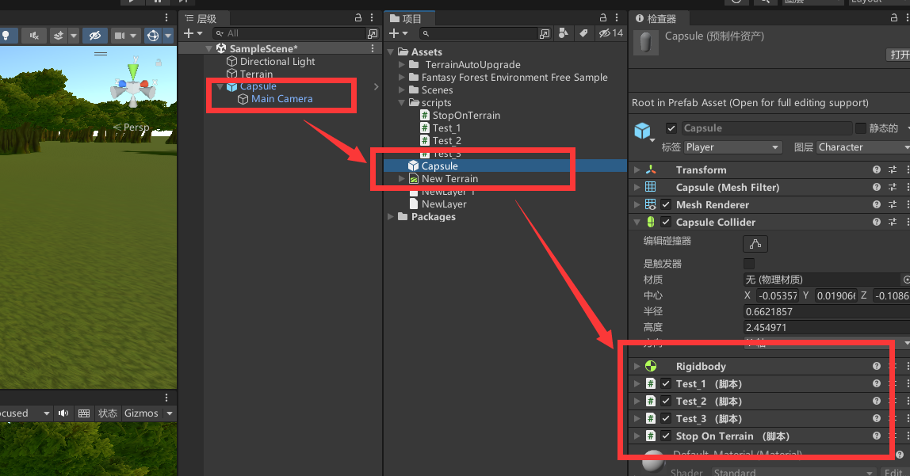
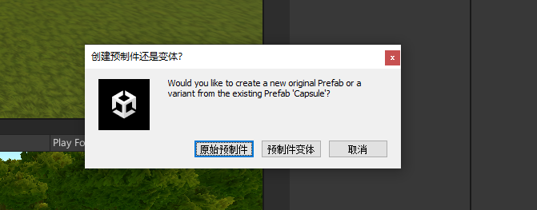
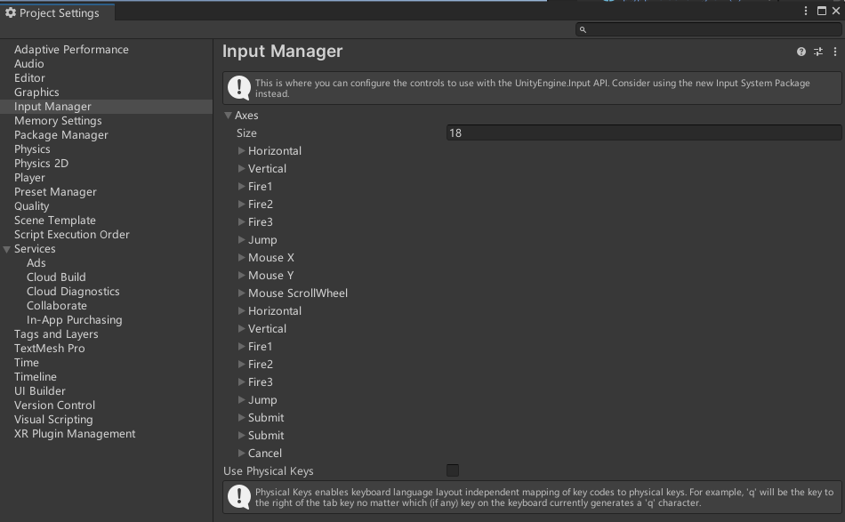
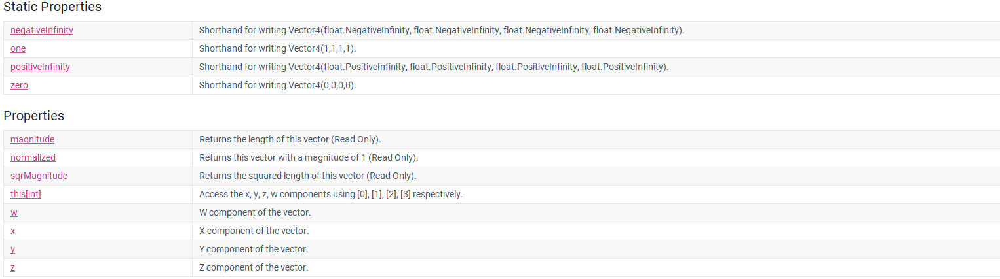
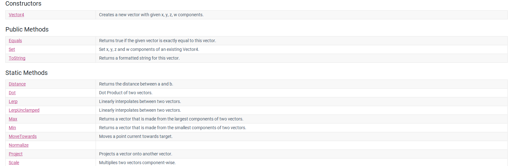
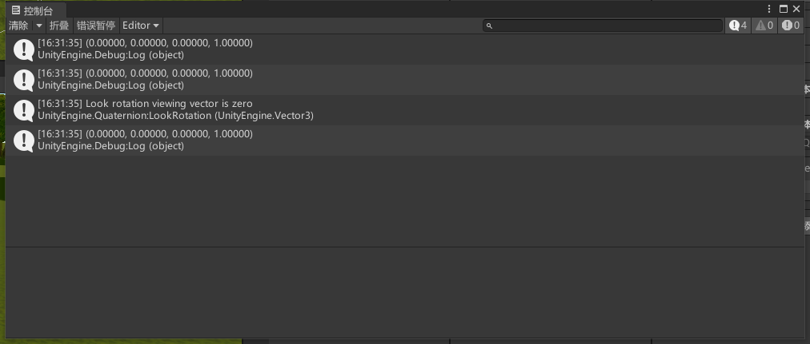
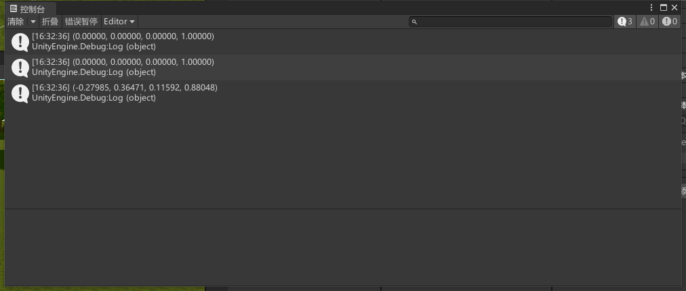
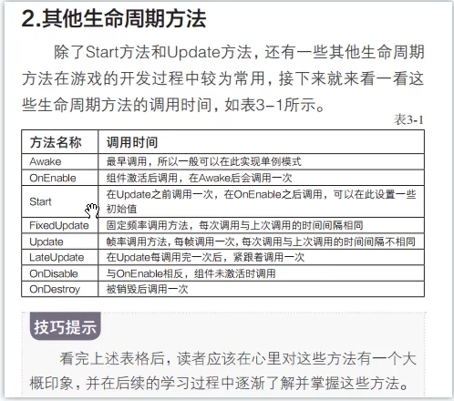
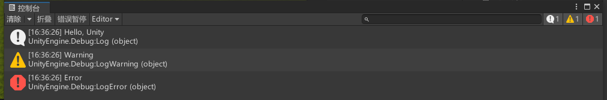

# Unity 学习

[TOC]


> 以下所有的学习记录均是基于3D！
>
> 参考官方文档:https://docs.unity.cn/cn/current/Manual/Quickstart3DCreate.html

# 一.入门知识

## 1. 基础知识

- Unity中一切均为对象`GameObjects`, 包括人物、道具等等。

- `GameObjects`生活在称为场景(***scenes***)的三维环境中。你可以把一个场景看作是一个游戏关卡，但它也可能代表一个菜单、游戏结束时的字幕或完全是其他东西。

- `GameObjects`的行为是由称为组件(***components***)的功能块定义的。你可以给`GameObjects`附加多个组件。

***以下组件是3D游戏的基础：***

- 变形(***Transform***)：变形组件决定了场景中每个`GameObjects`的位置、旋转和比例。每个`GameObjects`都有一个Transform组件。
- 网格过滤器(***Mesh Filter***)：这个组件定义了3D游戏对象的形状。
- 网格渲染器(***Mesh Renderer***)：这个组件定义了由网格过滤器定义的三维形状的外观。
- 相机(***Cameras***)：专门配置的`GameObjects`，用于捕获并向玩家显示世界。
- 刚体(***Rigidbody***)：刚体允许`GameObjects`与物理系统互动，包括重力和碰撞。见本指南的物理学部分。
- 碰撞器(***Colliders***)：这个组件为物理碰撞的目的定义了一个三维`GameObjects`的形状。

## 2. 脚本

Unity允许你使用脚本创建你自己的组件。脚本可以让你触发游戏事件，随着时间的推移修改组件属性，并对用户的输入做出反应。Unity本地支持C#编程语言。这里有一些例子说明你如何在游戏中使用脚本：

- 接收来自玩家的输入，让游戏对象根据该输入移动或行动。
- 设置赢和输的状态，打开相关的赢或输的场景，创建一个完整的游戏循环。
- 根据其他变量来影响`GameObjects`的组件，例如它们的变换、动画或渲染器。
  关于如何在Unity中使用脚本的细节，请参见脚本概述。要学习脚本的基础知识，请跟随Unity学习初级脚本课程。要获得更深入的指导，请看实例项目 [Create with Code](https://learn.unity.com/course/create-with-code) and [Creator Kit: Beginner Code](https://learn.unity.com/project/creator-kit-beginner-code).。

## 3. Animation

动画系统参考: [Introduction to 3D Animation Systems](https://learn.unity.com/course/introduction-to-3d-animation-systems?uv=2019.4).

## 4. Lighting

光效.

> A spotlight Light creates atmospheric lighting in this scene

## 5. Audio

音效，背景音乐等等。

> You can add background music and sound effects to your game in Unity; see [Audio Overview](https://docs.unity.cn/cn/current/Manual/AudioOverview.html). Use third-party software to create your audio and import it into Unity with the recommended settings.

## 6. 物理系统(Physics)

> The Player character has a capsule collider component which uses the Physics system to allow the character to collide with the walls.

## 7. 用户界面

> If you want to add a menu or help to your game, you need to set up a [user interface](https://docs.unity.cn/cn/current/Manual/UIToolkits.html). To set up a user interface, use [Unity UI](https://docs.unity.cn/cn/current/Manual/UIToolkits.html).


# 二. Create Gameplay

> 一个游戏物体具有许多不同的组件，不同的组件实现不同的功能，这样的话该游戏物体就会具有许多不同的功能!

## 1. Prefabs预制件

Unity 的**预制件**系统允许创建、配置和存储游戏对象及其所有组件、属性值和子游戏对象作为可重用资源。预制件资源充当模板，在此模板的基础之上可以在场景中创建新的预制件实例。

如果要在场景中的多个位置或项目中的多个场景之间重用以特定方式配置的游戏对象，比如非玩家角色 (NPC)、道具或景物，则应将此游戏对象转换为预制件。这种方式比简单复制和粘贴游戏对象更好，因为预制件系统可以自动保持所有副本同步。

对预制件资源所做的任何编辑都会自动反映在该预制件的实例中，因此可以轻松地对整个项目进行广泛的更改，而无需对资源的每个副本重复进行相同的编辑。

可将[预制件嵌套](https://docs.unity.cn/cn/current/Manual/NestedPrefabs.html)在另一个预制件中，从而创建在多个级别易于编辑的复杂对象层级视图。

但是，这并不意味着所有预制件实例都必须完全相同。如果希望预制件的某些实例与其他实例不同，则可以[覆盖](https://docs.unity.cn/cn/current/Manual/PrefabInstanceOverrides.html)各个预制件实例的设置。还可以创建预制件的[变体](https://docs.unity.cn/cn/current/Manual/PrefabVariants.html)，从而将一系列覆盖组合在一起成为有意义的预制件变化。

如果游戏对象在一开始不存在于场景中，而希望[在运行时实例化游戏对象](https://docs.unity.cn/cn/current/Manual/InstantiatingPrefabs.html)（例如，使能量块、特效、飞弹或 NPC 在游戏过程中的正确时间点出现），那么也应该使用预制件。

使用预制件的一些常见示例包括：

- 环境资源 - 例如，在一个关卡附近多次使用的某种树（如上面的截屏所示）。
- 非玩家角色 (NPC) - 例如，某种类型的机器人可能会在游戏的多个关卡之间多次出现。它们的移动速度或声音可能不同（使用*覆盖*）。
- 飞弹 - 例如，海盗的大炮可能会在每次射击时实例化炮弹预制件。
- 玩家主角 - 玩家预制件可能被放置在游戏每个关卡（不同场景）的起点。



即将我们设计好的对象进行封装为指定的预制件。

### 1.1 变体, 即继承预制件修改属性



创建的方式很简单，就是简单的拖动选择即可！

> 预制件和变体之间的关系就是，如果我们修改预制件，该预制件对应的所有实例的属性也会跟着变化，***并不包括其生成的变体***；
>
> 但是我们修改变体的话，***仅仅会修改对应的变体实例的属性***，其余的预制件对应的实例属性不会变化。


## 2. 用户的输入

### 2.1 按键名称

键名称遵循以下命名约定：

| **键系列** | **命名约定**                                                 |
| :--------- | :----------------------------------------------------------- |
| 字母键     | `a`, `b`, `c`…                                               |
| 数字键     | `1`, `2`, `3`…                                               |
| 箭头键     | `up`, `down`, `left`, `right`                                |
| 小键盘按键 | `[1]`, `[2]`, `[3]`, `[+]`, `[equals]`…                      |
| 修饰键     | `right shift`, `left shift`, `right ctrl`, `left ctrl`, `right alt`, `left alt`, `right cmd`, `left cmd` |
| 特殊键     | `backspace`, `tab`, `return`, `escape`, `space`, `delete`, `enter`, `insert`, `home`, `end`, `page up`, `page down` |
| 功能键     | `f1`, `f2`, `f3`…                                            |

将鼠标按钮命名为：`mouse 0、mouse 1、mouse 2`，以此类推。

还可以使用 [`Input.GetKey`](https://docs.unity.cn/cn/current/ScriptReference/Input.GetKey.html) 和上文指定的命名约定来查询特定键或	按钮的输入。例如：

```
Input.GetKey("a");
```

访问键的另一方法是使用 [`KeyCode`](https://docs.unity.cn/cn/current/ScriptReference/KeyCode.html) 枚举。

```C#
using UnityEngine;

public class KeyCodeExample : MonoBehaviour
{
    void Update()
    {
        if (Input.GetKeyDown(KeyCode.Space))
        {
            Debug.Log("Space key was pressed.");
        }

        if (Input.GetKeyUp(KeyCode.Space))
        {
            Debug.Log("Space key was released.");
        }
    }
}
```

### 2.2 虚拟轴

> ***来自ChatGPT的解释:***
>
> Unity中的虚拟轴（Virtual Axis）用于将输入轴（例如键盘按键或游戏手柄摇杆）映射到游戏中的某个动作，例如向左或向右移动。虚拟轴允许您使用相同的代码来处理不同的输入设备，而不必为每个设备编写特定的代码。
>
> 在Unity中，您可以使用Input Manager来创建和管理虚拟轴。通过创建虚拟轴，您可以轻松地检测玩家输入并将其应用于游戏对象的移动、旋转或任何其他可控制的动作。
>
> ***例如，您可以将水平方向上的虚拟轴映射到键盘上的左右箭头键和游戏手柄上的左摇杆，然后使用该虚拟轴来控制玩家角色在游戏中的左右移动。***
>
> 总之，Unity中的虚拟轴是一种方便的输入映射工具，可以使您的游戏输入代码更具可扩展性和可维护性。

> 来自博客：https://blog.csdn.net/qq_29266497/article/details/81710403

***概念：***
首先，啥子叫虚拟轴呢？
用我们通俗的话来说就是我们自己想象的一条范围是 -1~1之间的数轴。
为啥子要用到虚拟轴呢？
就是为了方便获取键盘的输入，其实就是一种简便方法。比如我们想使用A、D键和左、右键来控制游戏物体的左右移动时，按照我们的之前的思路是用一个if条件来判断四个键是否按下，
***而有了虚拟轴之后，我们只需要获取水平方向的输入就可以。***

> 意思就是我们对应每一个方向都会建立一个虚拟轴，然后我们可以将该虚拟轴和我们键盘上的按键绑定起来，如果按键按下的话就会返回对应的值。

```C#
public class Axis : MonoBehaviour {

    void Start () {

    }

    void Update () {
        //Horizontal是控制水平方向的值，也就是x轴的值
        //GetAxisRaw方法获取虚拟轴，当某键按下时会直接返回1或-1，没有变化过程
        float x1 = Input.GetAxisRaw("Horizontal");
        //GetAxis方法获取虚拟轴会有一个变化过程
        float x2 = Input.GetAxis("Horizontal");
        //Vertical是控制垂直方向的值，也就是z轴的值
        float y = Input.GetAxis("Vertical");
        //利用Translate方法来控制gameobject移动
        transform.Translate(new Vector3(x1,0,y)*Time.deltaTime);
    }
}
```




## 3. 游戏场景

> 一个游戏肯定是由多个游戏场景所组成的，每一个场景又是有许多游戏物体组成, 游戏物体又是由组件组成! 

我们需要现将所有的场景添加进来，然后在文件/生成设置中将我们的场景添加进来,***之后我们就可以进行场景之间的切换了!***

在Unity中，游戏场景的切换可以通过以下几种方式实现：

1. 使用场景管理器：Unity提供了场景管理器，可以通过该工具在编辑器中管理场景，包括新建、打开、保存、设置当前场景等操作。在游戏中，可以使用SceneManager类的LoadScene方法实现场景的切换。例如：

```
csharpCopy codeusing UnityEngine.SceneManagement;

// 加载名为"NewScene"的场景
SceneManager.LoadScene("NewScene");
```

1. 使用场景异步加载：对于较大的场景，使用场景异步加载可以避免在加载过程中游戏卡顿。可以使用SceneManager类的LoadSceneAsync方法实现异步加载。例如：

```
csharpCopy codeusing UnityEngine.SceneManagement;

// 异步加载名为"NewScene"的场景
AsyncOperation asyncLoad = SceneManager.LoadSceneAsync("NewScene");

while (!asyncLoad.isDone)
{
    // 等待场景加载完成
    yield return null;
}
```

1. 使用Application类：可以使用Application类的方法来加载、退出游戏或应用程序等。例如：

```
csharpCopy codeusing UnityEngine.SceneManagement;

// 加载名为"NewScene"的场景
Application.LoadLevel("NewScene");

// 退出游戏
Application.Quit();
```

需要注意的是，使用Application类的`LoadLevel`方法在Unity 5.3及以后版本已被弃用，推荐使用`SceneManager`类的`LoadScene`方法来替代。

***如果场景比较大的话：***

如果场景比较大，切换场景可能会导致游戏卡顿或者加载时间过长，影响游戏体验。为了解决这个问题，可以使用场景异步加载的方式，即在场景加载过程中不会阻塞游戏进程，允许玩家在后台加载场景，同时继续进行游戏。可以按照以下步骤来实现：

1. 在场景管理器中，将需要异步加载的场景标记为“异步加载”（Async）。
2. 在代码中使用SceneManager类的LoadSceneAsync方法异步加载场景。例如：

```
csharpCopy codeusing UnityEngine.SceneManagement;

// 异步加载名为"NewScene"的场景
AsyncOperation asyncLoad = SceneManager.LoadSceneAsync("NewScene", LoadSceneMode.Additive);

// 可以使用asyncLoad.progress属性获取加载进度
```

1. 在异步加载过程中，可以通过yield return null来让游戏进程保持运行，等待场景加载完成。例如：

```
csharpCopy codeusing UnityEngine.SceneManagement;

// 异步加载名为"NewScene"的场景
AsyncOperation asyncLoad = SceneManager.LoadSceneAsync("NewScene", LoadSceneMode.Additive);

while (!asyncLoad.isDone)
{
    // 等待场景加载完成
    yield return null;
}
```

1. 在场景加载完成后，可以使用SceneManager类的UnloadScene方法卸载原来的场景（可选）。

```
csharpCopy codeusing UnityEngine.SceneManagement;

// 卸载当前场景
SceneManager.UnloadSceneAsync(SceneManager.GetActiveScene());
```

注意，异步加载场景时需要注意内存的使用，避免出现内存泄漏或崩溃等问题。可以通过Profiler工具来监测内存使用情况。

## 4. 异步和同步

- 加载数据，消耗时间； 
- 加载场景， 消耗时间；
- 从网络读取数据， 消耗时间；

## 5. 了解Transform

***游戏中组件之间的父子关系是由组件Transform进行控制的!***

```C#
using System.Collections;
using System.Collections.Generic;
using UnityEngine;

public class TransformTest : MonoBehaviour
{
    public GameObject gameObjectTemp;
    // Start is called before the first frame update
    void Start()
    {
        // 获取位置
        Debug.Log(transform.position);
        Debug.Log(transform.localPosition);

        // 获取旋转
        Debug.Log(transform.rotation);
        Debug.Log(transform.localRotation);
        Debug.Log(transform.eulerAngles);
        Debug.Log(transform.localEulerAngles);

        // 获取缩放
        Debug.Log(transform.localScale);

        // 获取XYZ轴向量
        // X
        Debug.Log(transform.forward);
        // Z
        Debug.Log(transform.right);
        // Y
        Debug.Log(transform.up);

        // 父子关系
        // 获取父物体
        GameObject tempParent =  transform.parent.gameObject;
        // 子物体个数
        Debug.Log(transform.childCount);
        // 解除与子物体之间的父子关系
        transform.DetachChildren();
        // 获取子物体
        Transform transform_temp = transform.Find("Child");
        transform_temp = transform.GetChild(0);
        // 判断另一个物体是不是另外一个物体的子物体
        bool res = transform_temp.IsChildOf(transform);
        Debug.Log(res);
        // 设置为父物体
        transform_temp.SetParent(transform);

    }

    // Update is called once per frame
    void Update()
    {
        // 时时刻刻看向000点
        // transform.LookAt(Vector3.zero);

        // 绕着UP轴也就是Y轴旋转
        transform.Rotate(Vector3.up, 1);

        // 绕着某一个物体旋转
        // 这里我们需要穿进去三个参数，第一个是目标物体的位置，第二个是围绕哪一个轴进行旋转，第三个就是旋转的速率
        transform.RotateAround(gameObjectTemp.transform.position, Vector3.up, 5);
    }
}
```


# 三. 代码相关知识

## 1. `MonoBehaviour`

> 参看https://docs.unity.cn/cn/current/ScriptReference/MonoBehaviour.html

`MonoBehaviour` 是一个基类，所有 Unity 脚本都派生自该类。

使用 C# 时，必须显式派生自 `MonoBehaviour`。

该类不支持 [null 条件运算符](https://docs.microsoft.com/en-us/dotnet/csharp/language-reference/language-specification/expressions#null-conditional-operator) (**?.**) 和 [null 合并运算符](https://docs.microsoft.com/en-us/dotnet/csharp/language-reference/language-specification/expressions#the-null-coalescing-operator) (**??**)。

有关代码示例，请参阅各个 `MonoBehaviour` 方法。

## 2. 标签

我们在Unity中可以给对应的物体添加相应的标签，以供我们在代码中进行判断。

比如说给所有敌人都加上标签***enemy***。


## 3. 最常用的结构体Vector

**常用的有：Vector2、Vector3、Vector4，分别对应二维向量、三维向量、思维向量。**

常用的方法有（以Vector4举例）：





```C#
using System.Collections;
using System.Collections.Generic;
using UnityEngine;

public class TestVector : MonoBehaviour
{
    // Start is called before the first frame update
    void Start()
    {
        // 该向量可以代表坐标，旋转，缩放等等
        Vector3 vector3 = new Vector3(1, 1, 1);
        Vector3 vector3_1 = new Vector3(0, 1, 0);

        // 求出两个向量的夹角
        Debug.Log(Vector3.Angle(vector3, vector3_1));

        // 计算两点之间的距离
        Debug.Log(Vector3.Distance(vector3, vector3_1));

        // 点乘
        Debug.Log(Vector3.Dot(vector3, vector3_1));

        // 叉乘
        Debug.Log(Vector3.Cross(vector3, vector3_1));

        // 插值, 和后面的动画制作有关，一个时间平滑的过渡
        Debug.Log(Vector3.Lerp(Vector3.zero, Vector3.one, 0.8f));
    }
    // Update is called once per frame
    void Update()
    {
        
    }
}
```

## 4. 欧拉角和四元数，旋转的表示方法

> 二者可以互相转换!

```C#
// Start is called before the first frame update
void Start()
{
    // 创建四元数
    Quaternion quaternion = Quaternion.identity;
    Debug.Log(quaternion);
    quaternion = transform.rotation;
    Debug.Log(quaternion);

    // 看向某一个向量的方向
    quaternion = Quaternion.LookRotation(new Vector3(0, 0, 0));
    Debug.Log(quaternion);

}
```

运行结果为:



修改参数：

```C#
quaternion = Quaternion.LookRotation(new Vector3(1, 1, 1));
Debug.Log(quaternion);
```

运行结果:



## 5. 物体类的使用

```C#
public GameObject Cube;

// Start is called before the first frame update
void Start()
{
    // 拿到当前脚本所挂载的物体
    GameObject gameObject = this.gameObject;
    Debug.Log(gameObject.name);
    // Tag
    Debug.Log(gameObject.tag);
    // Layer
    Debug.Log(gameObject.layer);
    // 打印子组件的信息
    Debug.Log(Cube.name);
    // 当前对应组件真正的激活状态
    Debug.Log(Cube.activeInHierarchy);
    // 判断自身的激活状态
    Debug.Log(Cube.activeSelf);
    // 获取Transform组件
    Transform transform = this.transform;
    Debug.Log(transform);
  	// 获取其余的组件，比如说碰撞体等等
    CapsuleCollider box = GetComponent<CapsuleCollider>();
    Debug.Log(box);

    // 获取当前物体的子物体身上的某个组件
    // GetComponentInChildren<CapsuleCollider>(box);

    // 获取当前物体的父物体身上的某个组件
    // GetComponentInParent<BoxCollider>(box);

    // 添加一个组件
    gameObject.AddComponent<AudioSource>();

    // 通过游戏物体的名称来获取游戏物体
    // GameObject test = GameObject.Find("Test");

    // 通过游戏标签来获取游戏物体
    // test = GameObject.FindWithTag("Enemy");
    // 设置组件的激活状态
    // test.SetActive(false);
}
```

通过代码去实例化一个物体:

```C#
// 通过代码去实例化一个物体
// 1. 我们需要先获得预制件
public GameObject Prefab;

void Start()
{
  Instantiate(Prefab, transform);
  
  // 销毁组件
  Destroy(temp);
}

```


## 6. 游戏时间的使用

```C#
using System.Collections;
using System.Collections.Generic;
using UnityEngine;

public class TimeTest : MonoBehaviour
{
    float timer = 0;
    // Start is called before the first frame update
    void Start()
    {
        // 游戏从开始到现在所花费的时间
        Debug.Log(Time.time);
        // 时间的缩放值，就是时间倍速
        Debug.Log(Time.timeScale);
        // 固定时间间隔
        Debug.Log(Time.fixedDeltaTime);
        // 上一帧到这一帧所用的游戏时间
        Debug.Log(Time.deltaTime);
        
    }

    // Update is called once per frame
    void Update()
    {
        // 计时器
        timer += Time.deltaTime;
        // 上一帧到这一帧所用的游戏时间
        Debug.Log(Time.deltaTime);

        // 如果游戏运行时间大于10秒的话
        if (timer > 10)
        {
            Debug.Log("时间大于10秒");
        }
    }
}
```


## 7. Application类的使用，权限控制

```C#
using System.Collections;
using System.Collections.Generic;
using UnityEngine;

public class ApplicationTest : MonoBehaviour
{
    // Start is called before the first frame update
    void Start()
    {
        // 1. 游戏数据文件夹路径(只读，加密存储)
        Debug.Log(Application.dataPath);
        // 上面的函数会返回文件路径:D:/Desktop/Unity/FirstProject/Assets,即我们工程的文件夹
        // 这样的话，如果我们想要获得我们工程中的某一个文件的话，就可以使用下面的方式:
        // Debug.Log(Application.dataPath + '/新建文件');

        // 2. 持久化文件路径(可写)
        Debug.Log(Application.persistentDataPath);
        // 输出结果:
        // C:/Users/z1769/AppData/LocalLow/DefaultCompany/FirstProject

        // 3. StreamingAssets文件夹路径(只读)
        Debug.Log(Application.streamingAssetsPath);
        // 输出结果:
        // D:/Desktop/Unity/FirstProject/Assets/StreamingAssets
        // 该文件路径师用来存储一些配置文件的，该文件里面的内容是不需要进行加密的

        // 4. 临时文件夹
        Debug.Log(Application.temporaryCachePath);
        // 输出结果:
        // C:/Users/z1769/AppData/Local/Temp/DefaultCompany/FirstProject

        // 控制是否在后台运行
        Debug.Log(Application.runInBackground);

        // 5. 打开URL
        Application.OpenURL("www.google.com");

        // 6. 退出游戏
        Application.Quit();

    }

    // Update is called once per frame
    void Update()
    {
        
    }
}
```

## 8. 场景类

```C#
using System.Collections;
using System.Collections.Generic;
using UnityEngine;
using UnityEngine.SceneManagement;
using UnityEngine.UIElements;

public class SceneTest : MonoBehaviour
{
    public Slider progressBar;
    // Start is called before the first frame update
    IEnumerator Start()
    {
        // 两个类，场景类，场景管理类

        // 下面的代码，我们传入参数的时候，可以传入场景的名称或者场景的编号
        // SceneManager.LoadScene("MyScene");

        // 异步加载名为"NewScene"的场景
        AsyncOperation asyncOperation = SceneManager.LoadSceneAsync("MyScene");
        while (!asyncOperation.isDone)
        {
            // 获取场景加载的进度条，并且设置进度条的值
            float progress = Mathf.Clamp01(asyncOperation.progress / 0.9f);
            progressBar = GetComponent<Slider>();
            progressBar.value = progress;
            // 等待场景加载完成
            yield return null;
        }

        // 异步加载完场景之后，执行其余的动作，比如说我们可以将之前的场景卸载
        SceneManager.UnloadSceneAsync(SceneManager.GetActiveScene());
        // 我们异步加载场景的时候还可以获取加载的进度
        // 我们可以使用asyncOperatioin.progress属性来获得加载的进度


    }

    // Update is called once per frame
    void Update()
    {
        
    }
}
```

另外的一些常用的函数:

```C#
// 获取当前场景
Scene scene = SceneManager.GetActiveScene();
Debug.Log(scene.name);
// 场景是否已经被加载
Debug.Log(scene.isLoaded);
// 场景路径
Debug.Log(scene.path);

// 场景索引号
Debug.Log(scene.buildIndex);

// 得到当前所有的游戏物体
GameObject[] objects = scene.GetRootGameObjects();
Debug.Log(objects.Length);

// 创建新场景
Scene newScene = SceneManager.CreateScene("MySecondScene");
// 已加载场景个数
Debug.Log(SceneManager.sceneCount);

// 卸载场景
SceneManager.UnloadSceneAsync(newScene);

// 加载场景，替换场景,Single参数作用是替换, Additive是共存，会将两个场景的东西叠加在一起
// SceneManager.LoadScene("MyScene", LoadSceneMode.Single);
SceneManager.LoadScene("MyScene", LoadSceneMode.Additive);
```

***异步加载场景:***

```C#
using System.Collections;
using System.Collections.Generic;
using UnityEngine;
using UnityEngine.SceneManagement;

public class AsyncTest : MonoBehaviour
{
    AsyncOperation operation;
    // Start is called before the first frame update
    void Start()
    {
        StartCoroutine(LoadScene());
    }

    // 协程方法用来异步加载场景
    IEnumerator LoadScene()
    {
        operation = SceneManager.LoadSceneAsync(1);
        // 加载完成场景先不要进行跳转，等待玩家进行交互，然后再去进行跳转
        operation.allowSceneActivation = false;
        yield return operation;
    }

    float timer = 0;

    // Update is called once per frame
    void Update()
    {
        // 加载场景数值的最大值为0.9
        Debug.Log(operation.progress);
        timer += Time.deltaTime;
        if (timer >5)
        {
            operation.allowSceneActivation = true;
        }
    }
}
```


# 四. 生命周期方法



## 1. `OnDestory`

当脚本组件被销毁的时候就会调用该函数!

# 五. 调试方法

## 5.1 日志输出

```C#
// Start is called before the first frame update
void Start()
{
    Debug.Log("Hello, Unity");
    Debug.LogWarning("Warning");
    Debug.LogError("Error");
}
```

运行输出结果:



## 5.2 图像绘制

```C#
// Update is called once per frame
void Update()
{
    // 绘制一条线
    Debug.DrawLine(Vector3.zero, Vector3.one);

    // 绘制一条射线
    Debug.DrawRay(Vector3.zero, Vector3.up, Color.red);
}
```

