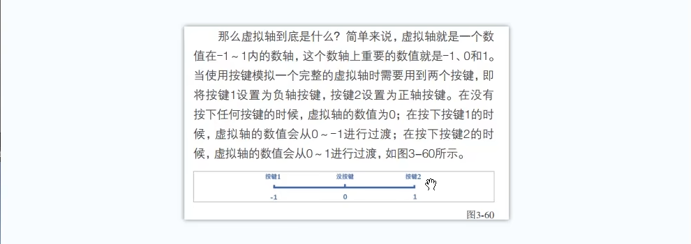
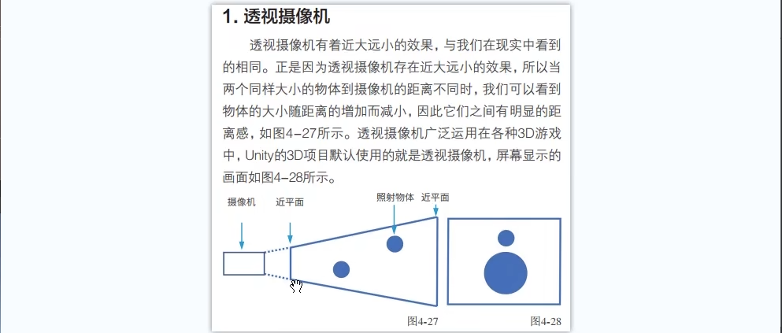
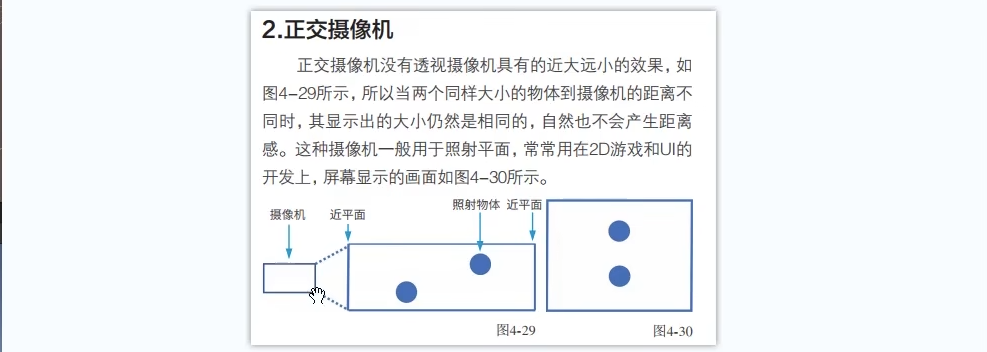
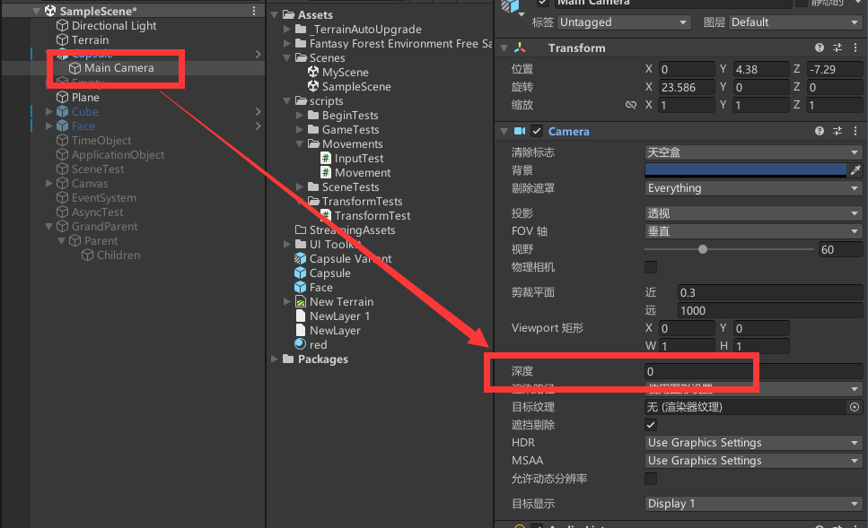
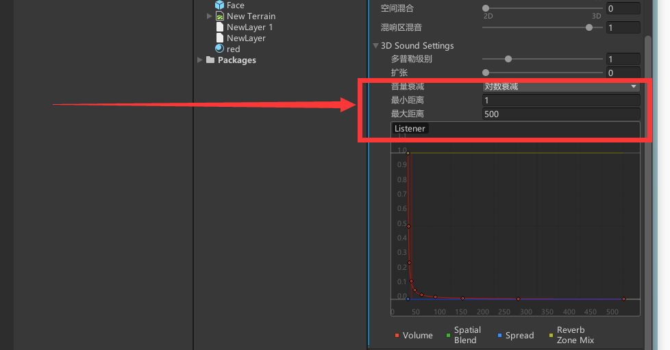

# Unity基础知识二

# 1. Create GamePlay

## 1.1 键盘和鼠标输入

> 键盘和鼠标的点击，系统时时刻刻去监听，所以说键鼠时间我们需要在Update函数中写!

```C#
void Update()
{
    // 鼠标的点击
    // 按下鼠标左键0、中间2、右键1
    if (Input.GetKeyDown(KeyCode.Mouse0))
    {
        Debug.Log("鼠标左键点击");
    }

    if (Input.GetKeyDown(KeyCode.Mouse1))
    {
        Debug.Log("鼠标右键点击");
    }

    if (Input.GetKeyDown(KeyCode.Mouse2))
    {
        Debug.Log("鼠标中键点击");
    }

    // 持续按下某一个按键
    if (Input.GetKey(KeyCode.Mouse0))
    {
        Debug.Log("持续按下鼠标左键");
    }
  
  	if (Input.GetKeyUp(KeyCode.Mouse0))
    {
        Debug.Log("鼠标左键抬起");
    }
}
```

### 1.1.1 虚拟轴再回顾



***当一个虚拟轴只有一个按键的时候，其构造不成虚拟轴，其仅仅是一个虚拟按键!***

```C#
// Update is called once per frame
void Update()
{
    // 获取水平轴
    float horizontal = Input.GetAxis("Horizontal");
    float vertical = Input.GetAxis("Vertical");
    Debug.Log("horizontal: "+horizontal + "  , vertical: " + vertical);

    // 虚拟按键
    if (Input.GetButtonDown("Jump"))
    {
        Debug.Log("空格");
    }
}
```

## 1.2 场景中的摄像机

- 透视摄像机：




- 正交摄像机：



> ***可以选择天空盒skybox来渲染出不一样的天空效果，该组件是在摄像机上面的!***

### 1.2.1 多个摄像机

当场景中具有多个摄像机的话，游戏画面会优先使用深度高的摄像机：



我们还可以做到多个相机拍摄到的画面融合成一个画面!

## 1.3 声音的使用

> 音乐和音效。

### 1.3.1 声音的接收

接收声音是位于摄像机上面的***Audio Listener***组件.

### 1.3.2 声音的播放

借助于组件***Audio Source***.

我们可以控制其中的***最小距离***和***最大距离***属性来模拟实际上声音伴随着距离的增减而发生的改变!



```C#
private AudioSource player;

// 暂停播放
Pause();

// 取消暂停
UnPause();

// 暂停
Stop();

// 从头开始
Play();

// 就播放一次，绑定按键
if(Input.GetKeyDown(KeyCode.Mouse0))
{
  player.PlayOneShot(se);
}
```

## 1.4 角色控制器的使用

三种解决方案：

- 从应用商店中去寻找，里面有很多完善的；
- 使用unity提供的角色控制器；
- 利用后面的物理系统自己去设计；

```C#
using System.Collections;
using System.Collections.Generic;
using UnityEngine;

public class BeginMove : MonoBehaviour
{
    private CharacterController player;
    // Start is called before the first frame update
    void Start()
    {
        player = GetComponent<CharacterController>();
    }

    // Update is called once per frame
    void Update()
    {
        // 水平轴
        float horizontal = Input.GetAxis("Horizontal");
        // 垂直轴
        float vertical = Input.GetAxis("Vertical");

        // 创建成一个方向向量    
        Vector3 dir = new Vector3(horizontal, 0, vertical);

        // 玩家朝向该方向移动
        player.SimpleMove(dir * 10);
    }
}
```

## 1.5 物理系统


# 2.触发和碰撞

## 2.1 触发&碰撞

> 如果我们将一个碰撞器设置为触发器的时候，我们就可以穿过该物体，但是没有设置为触发器的时候就不一样了，我们是不能穿过相应的物体的。


# 3. 物理材质

> 实际上就是修改物理材质的相关参数，设置静摩擦力和动摩擦力以及弹力什么的？接着我们可以获取相关的参数进行互动。


# 4. 射线检测


# 5. 动画系统

> 和虚幻引擎类似，一样是不同动画之间设置过渡条件，接着我们通过按键来触发相应的条件，这样我们就是实现了一个简单的动画过渡。


